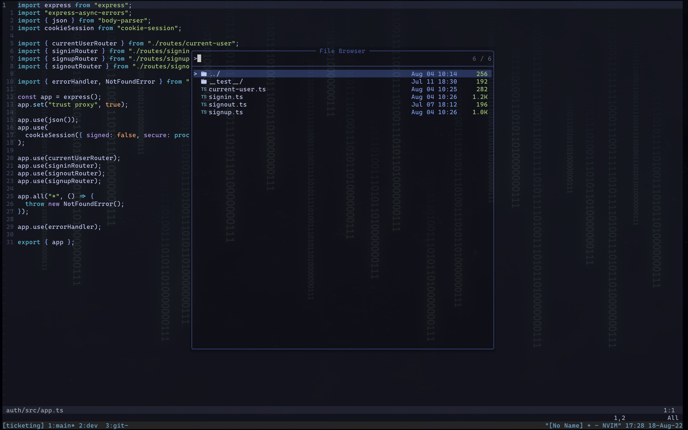

# My personal dotfiles 🤝



I use vim btw. 😎

## Things you need to install before using these dotfiles

- Main:
  - [neovim](#neovim) (>=0.6)
  - [tmux](#tmux) (>=3.2)
  - [zsh](#zsh)
  - [lua & luarocks](#lua)
  - [stow](#stow)
  - [fzf](#fzf) (>=0.23)
- Tools:
  - [oh my zsh](https://ohmyz.sh/)
  - [packer](#packer)
  - [tpm](https://github.com/tmux-plugins/tpm)
  - [fd](https://github.com/sharkdp/fd)
  - [rg](https://github.com/BurntSushi/ripgrep)
  - [gum](https://github.com/charmbracelet/gum)
  - [nerd font](#nerd-font)

## Usage

1. Clone this repo on your home directory.

2. Install all depenedencies based on instructions.

3. Then based on your platform run `./ubuntu` or `./macOS`. It would stow the dotfiles on your home directory.

## Actions

- After installing tpm, inside tmux use `prefix + I` to install tmux packages.
- After installing neovim and packer, use :PackerInstall to install neovim packages.

### neovim

On macOS, installing from brew should be fine. But on ubuntu if apt did not have version 0.6 or above by the time, you can use snippet below. [Source](https://www.codegrepper.com/code-examples/shell/ubuntu+install+neovim+0.6). OR maybe build it from the source ?

```bash
sudo add-apt-repository ppa:neovim-ppa/unstable
sudo apt-get update
sudo apt-get install neovim
```

### tmux

On macOS, installing from brew should be fine. But on ubuntu if apt did not have version 3.2 or above by the time, follow the [instructions](https://github.com/tmux/tmux/wiki/Installing) to build it from source. Here is a quick summary:

1. Install these packages:

```bash
libevent-dev ncurses-dev build-essential bison pkg-config make automake autotools-dev bison autoconf
```

2. Go to /use/locals
3. Run snippet below:

```bash
git clone https://github.com/tmux/tmux.git
cd tmux
sh autogen.sh
./configure
make && sudo make install
```

### zsh

Install it from apt and then install oh-my-zsh, it will take care of everything.

### stow

Install from apt or brew.

### lua

If you have neovim installed, chances are you already have lua, also checkout this [site](https://lindevs.com/install-lua-from-source-code-on-ubuntu/), it will help you build lua from source.

### fzf

On macOS installing from brew should be fine but on ubuntu it's beter to clone from the [repo](https://github.com/junegunn/fzf) and run install script.

### packer

Follow the instructions in this [repo](https://github.com/wbthomason/packer.nvim) and install it.

### nerd-font

1. Go to the [repo](https://github.com/ryanoasis/nerd-fonts) and then from the fonts table choose a font. "Caskaydia Cove Nerd Font" or "Fira Code Nerd Font" are suggested.

2. In order to install click on the link for any font you chose. Generally it's something like: Go to Regular directory and find a complete directory and install the font on your system (otf versions are the best). OR follow the instruction on the readme of the font.

3. Change the font of your terminal to the font you installed.
